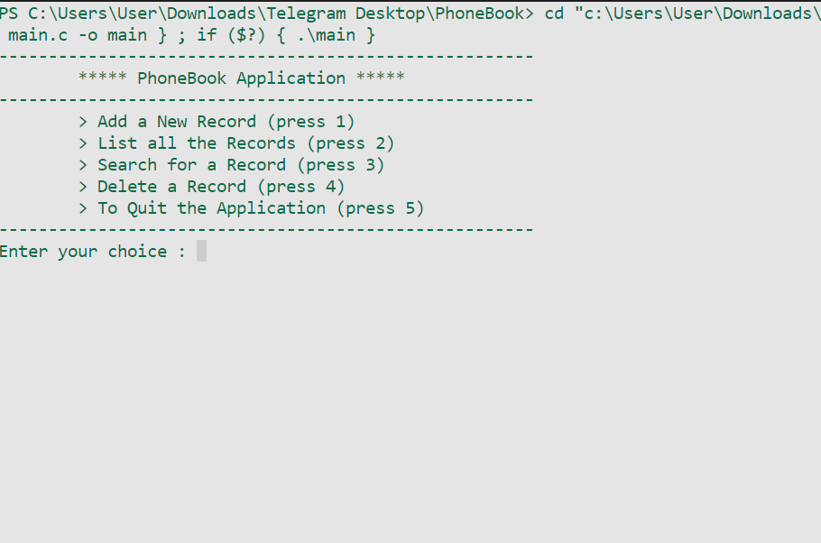
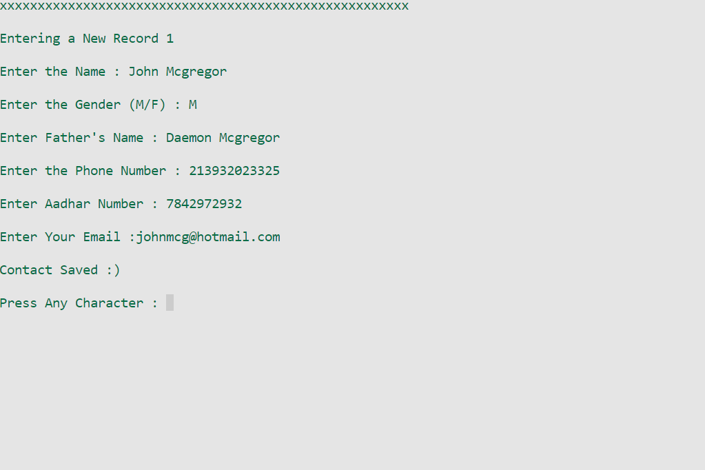
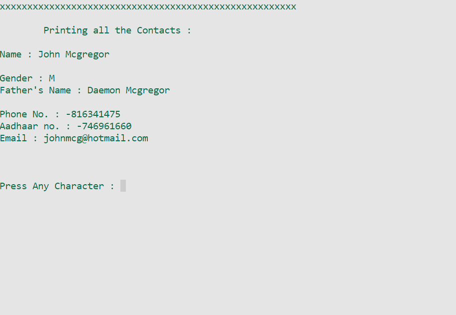

# **PhoneBook**

## Description
Welcome to PhoneBook, A Simple Contacts Management System made with __C language__ using concepts of File Handling. In this, user can store their Contact information for Emergency cases

## Features

- Add new Contact Details
- List all the Contacts
- Search for Contacts
- Delete Contact Details

Add user details

List user details
